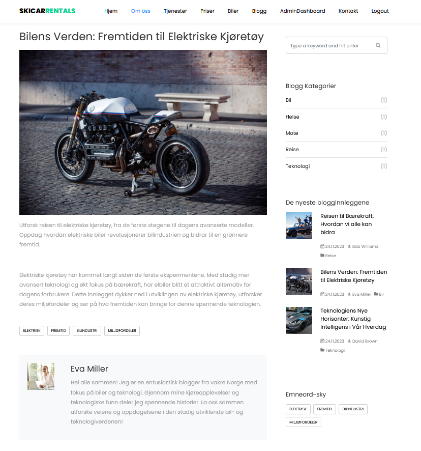
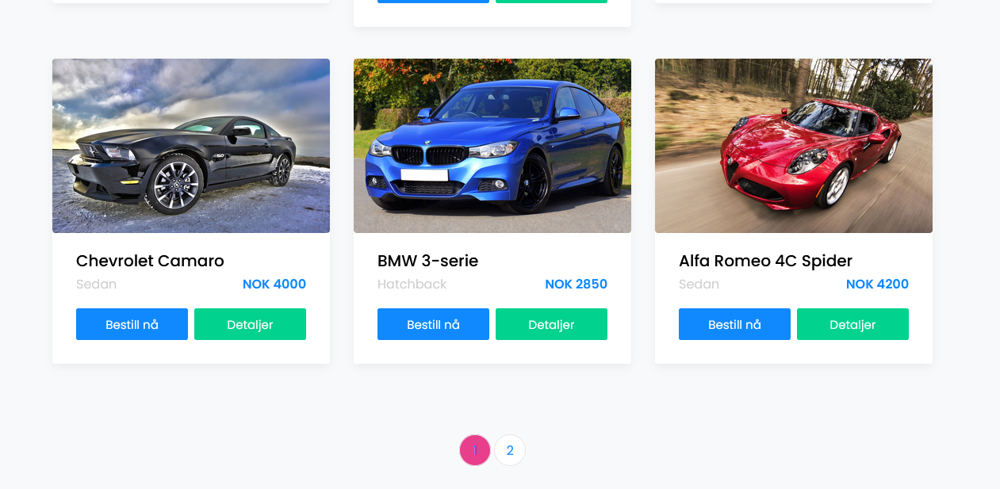
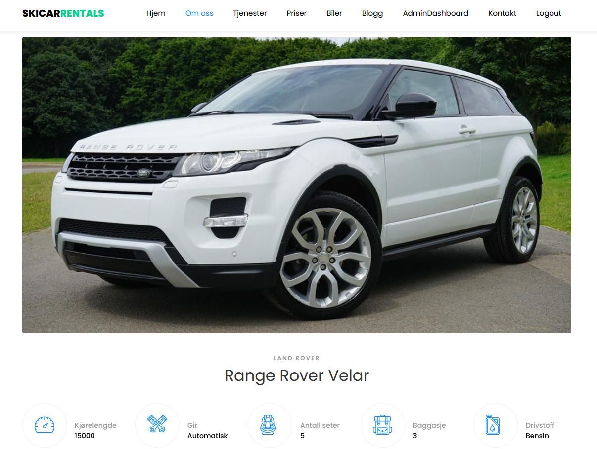
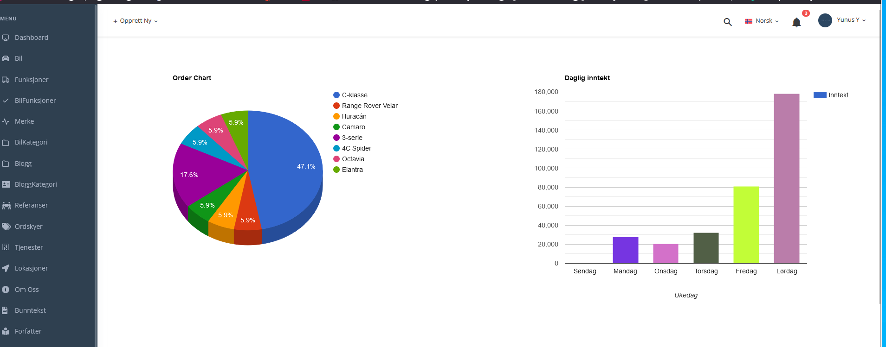
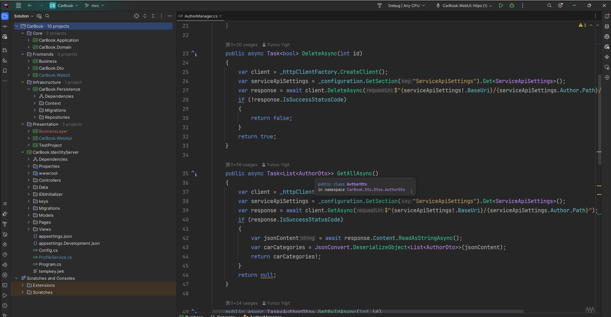
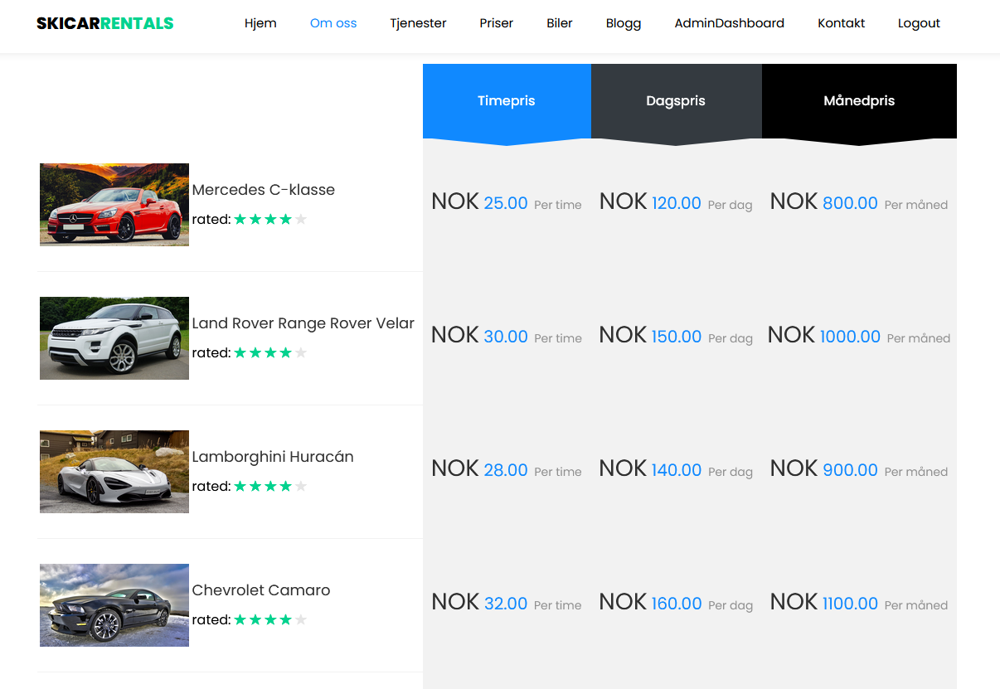
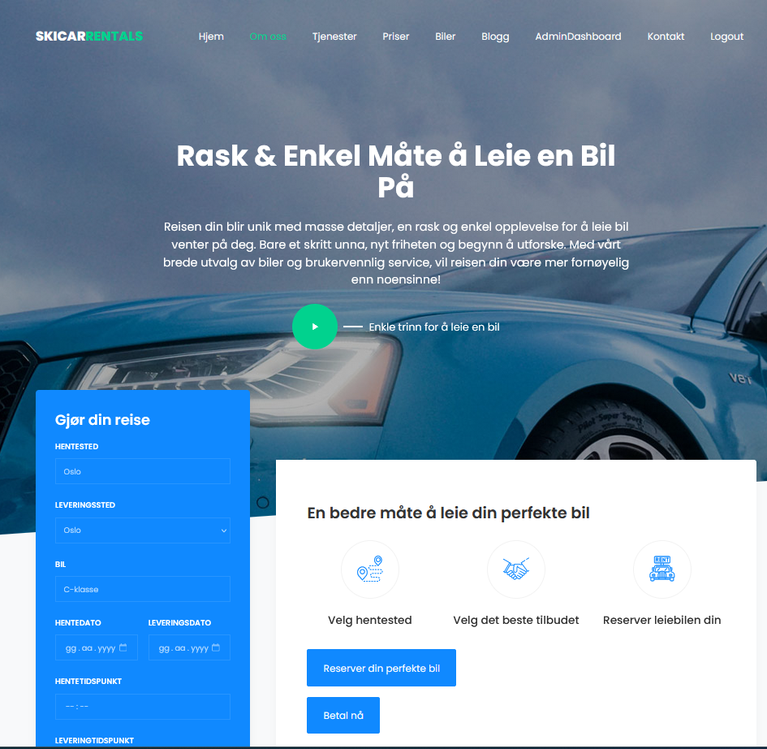
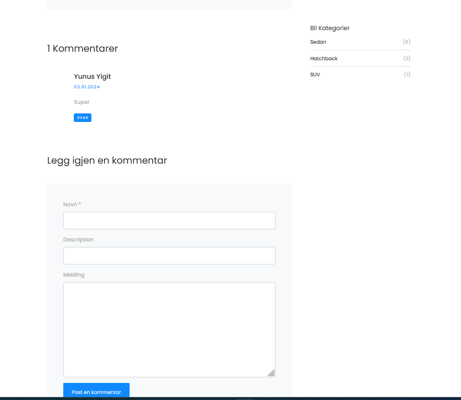
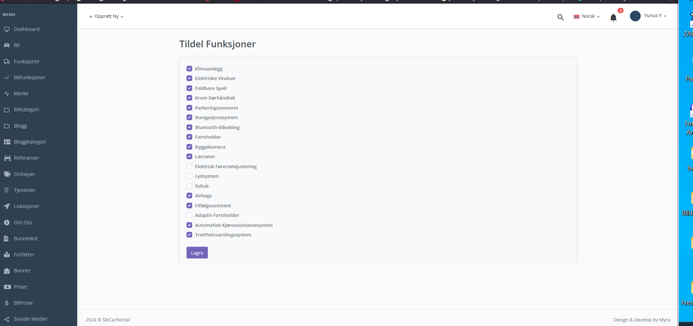

# Carbook Project

## Overview

Welcome to the Carbook project! This repository documents my journey through the Carbook Udemy course under the expert guidance of Murat Yücedağ. The course, developed using ASP.NET Core API 8.0, follows the principles of Onion Architecture, providing a comprehensive understanding of modern web development.

## Course Details

- **Instructor:** Murat Yücedağ
- **Course Link:** [Carbook Udemy Course](https://lnkd.in/dyJhCTaH)

## Project Highlights

### Architecture and Design Patterns

- **Onion Architecture:** Embracing a layered architecture for sustainability and extensibility.
- **Design Patterns:** Incorporation of Mediator, CQRS, and Repository patterns for advanced project structure.

### Business Layer Integration

- **API Consumption:** Integrated the Business layer for API consumption in Frontend.
- **Dockerization:** Minimized dependencies and accelerated development processes by Dockerizing the project.

### Backend and Frontend Separation

- **Modular Structure:** Carefully separated backend and frontend using MVC, JavaScript, and .NET 8.0 API.

### Exciting Project Phases

- **IdentityServer Integration:** Enhanced security and customization options.
- **Admin Dashboard:** Added for enhanced project management.
- **Google Charts:** Dynamic statistical graphs for improved user interaction.

### Streamlined Processes

- **Payment Integration:** Users can easily make vehicle reservations using Stripe payment.
- **Simplified User Experience:** Processes like adding vehicles and selecting features have been streamlined.

### Visual Appeal and Design Confidence

- **Google Charts and PDF Output:** Added for a visually appealing project design.

## Future Goals

With the knowledge gained, the project is set to evolve further, exploring new features and improvements. Join me on this exciting journey of continuous learning and development!

## Next Steps - SignalR Course

Having completed this project, I am now diving into Murat Yücedağ's Udemy course, focusing on building a QR code-based ordering application for restaurants using SignalR.

## Accessing the Project

For those interested, the project's source code is easily accessible on [GitHub](https://lnkd.in/dcWQVx72).

Feel free to connect and share your thoughts! Thank you for being part of this exciting journey! 🚀💻 #CarbookProject #SoftwareDevelopment #ContinuousLearning

## Images

)

.png).

.png)

